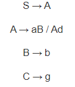

# Write a program to find First of any given grammar.

## Input Format

<p>If this is the original grammar to be entered as input, </p>



input format for this program should be like this: 

```
    S=A
    A=aB/Ad
    B=b
    C=g
```

where,

1. All arrows should be '=' sign.
2. No spaces allowed.
3. Capital Letters only as Non-terminal symbols and small letters as terminals.
4. '/' only, not '\'.

